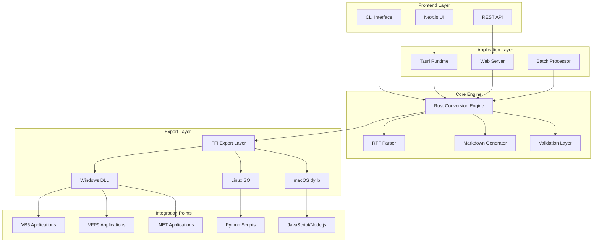
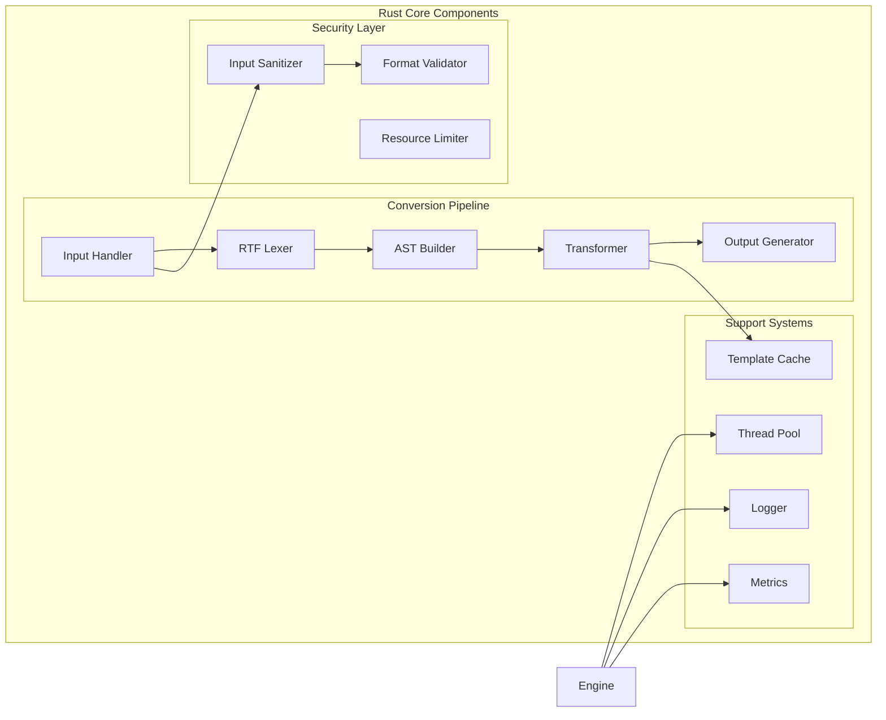
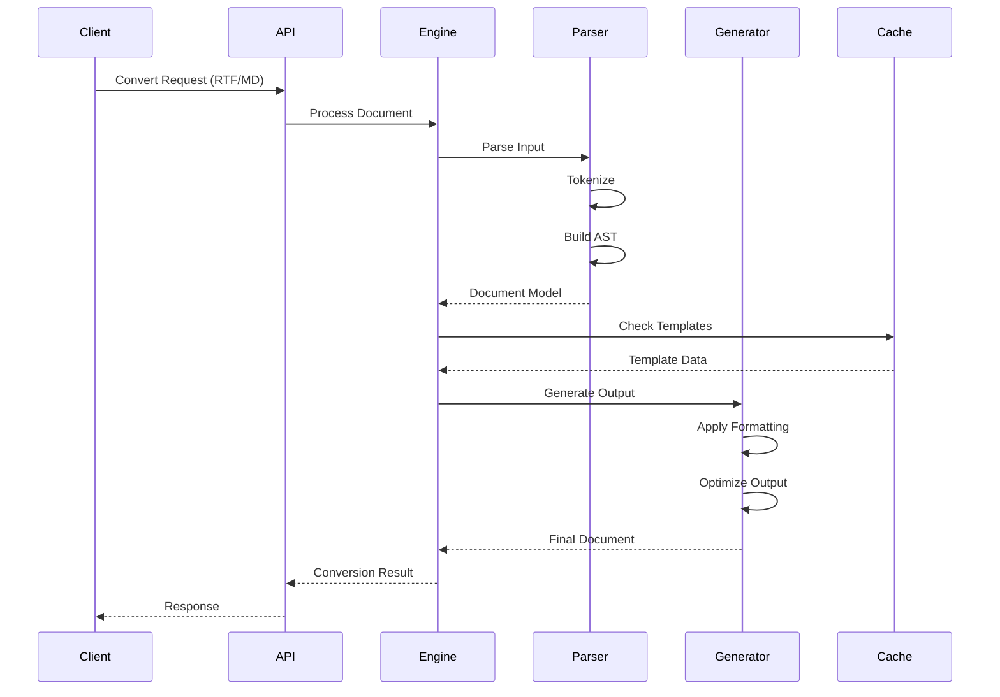
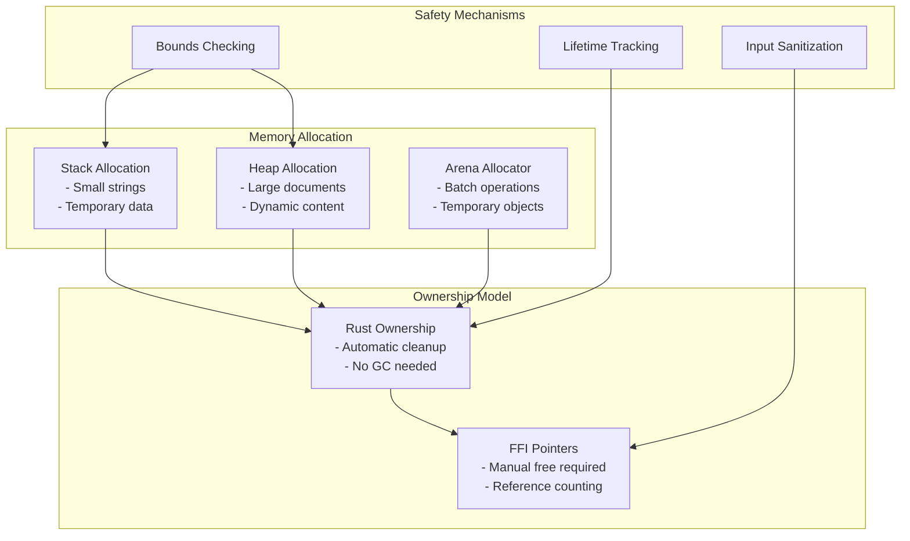
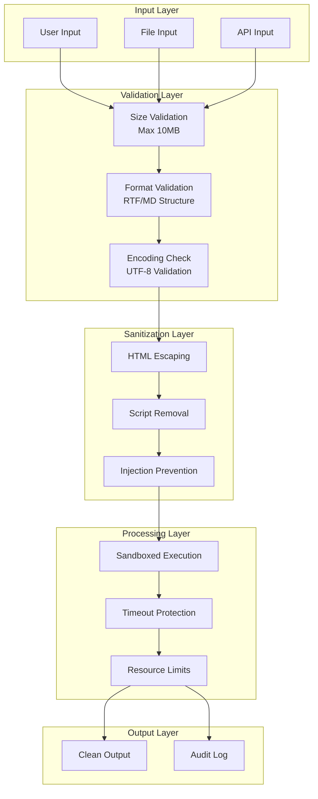
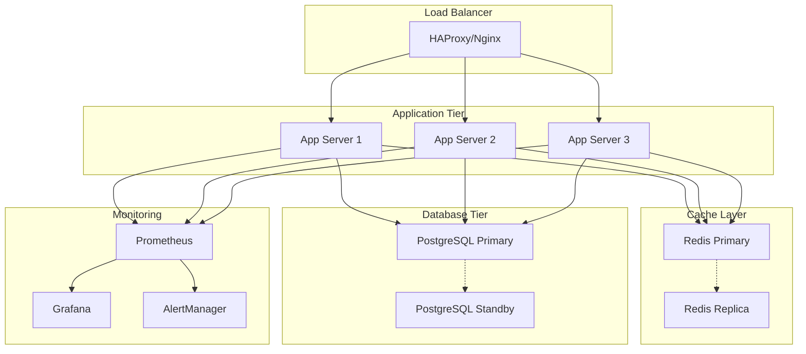
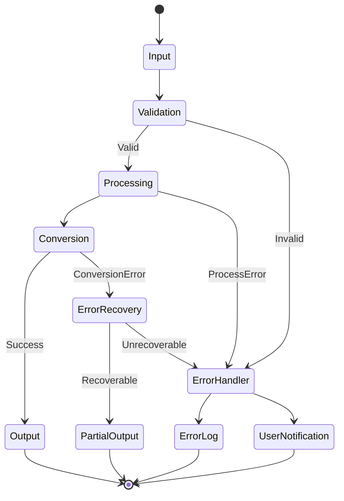
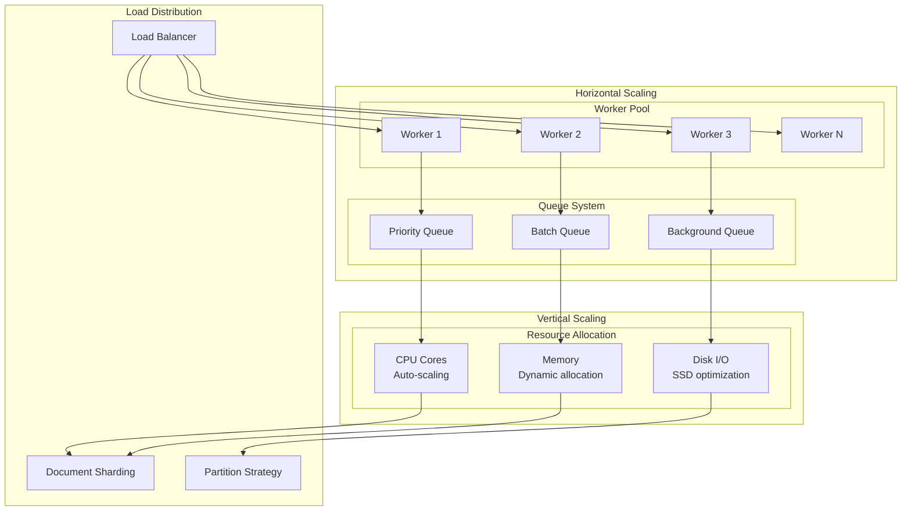
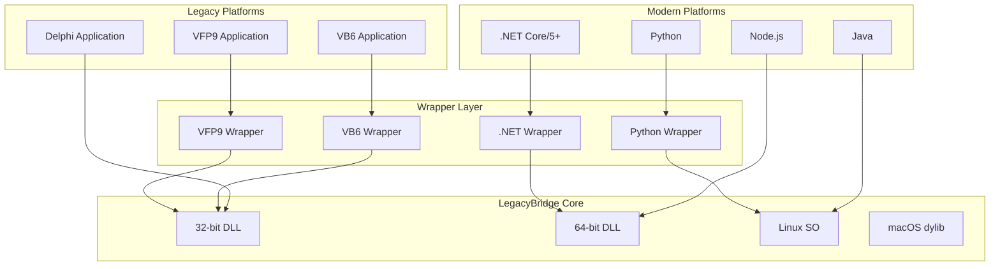

# System Architecture Overview

## High-Level Architecture

LegacyBridge is designed as a modular, high-performance document conversion system that bridges legacy RTF systems with modern Markdown workflows.

## Component Architecture

## Data Flow Architecture

## Memory Management Architecture

## Security Architecture

## Deployment Architecture

## Performance Optimization Architecture

```mermaid
graph LR
    subgraph "Optimization Layers"
        direction TB
        
        subgraph "Parse Optimization"
            SIMD[SIMD Instructions]
            PARALLEL[Parallel Tokenization]
            CACHE_PARSE[Parse Cache]
        end
        
        subgraph "Memory Optimization"
            POOL_ALLOC[Object Pooling]
            ARENA_ALLOC[Arena Allocation]
            ZERO_COPY[Zero-Copy Strings]
        end
        
        subgraph "I/O Optimization"
            ASYNC[Async I/O]
            BUFFER[Buffer Management]
            STREAM[Stream Processing]
        end
    end
    
    INPUT[Document Input] --> SIMD
    SIMD --> PARALLEL
    PARALLEL --> CACHE_PARSE
    
    CACHE_PARSE --> POOL_ALLOC
    POOL_ALLOC --> ARENA_ALLOC
    ARENA_ALLOC --> ZERO_COPY
    
    ZERO_COPY --> ASYNC
    ASYNC --> BUFFER
    BUFFER --> STREAM
    
    STREAM --> OUTPUT[Optimized Output]
```

## Error Handling Architecture

## Scalability Architecture

## Platform Integration Architecture

## Key Architecture Principles

### 1. **Modularity**
- Clear separation of concerns
- Pluggable components
- Independent scaling

### 2. **Performance**
- Zero-copy operations where possible
- SIMD optimization for parsing
- Efficient memory management

### 3. **Security**
- Input validation at every layer
- Sandboxed execution
- Resource limits enforced

### 4. **Compatibility**
- Multiple platform support
- Legacy system integration
- Forward compatibility

### 5. **Reliability**
- Comprehensive error handling
- Graceful degradation
- Automatic recovery

## Architecture Decision Records (ADRs)

### ADR-001: Rust as Core Language
- **Decision**: Use Rust for the core conversion engine
- **Rationale**: Memory safety, performance, and FFI capabilities
- **Consequences**: Excellent performance and safety, steeper learning curve

### ADR-002: FFI for Legacy Integration
- **Decision**: Use C-compatible FFI for legacy system integration
- **Rationale**: Maximum compatibility with VB6, VFP9, and other legacy systems
- **Consequences**: Manual memory management at boundaries, excellent compatibility

### ADR-003: Template-Based RTF Generation
- **Decision**: Use template system for RTF output
- **Rationale**: Consistent formatting, easier customization
- **Consequences**: Better maintainability, slight performance overhead

### ADR-004: 10MB File Size Limit
- **Decision**: Impose 10MB limit on single document conversions
- **Rationale**: Prevent DoS attacks, ensure predictable performance
- **Consequences**: Large documents need splitting, protects system resources

---

For interactive architecture diagrams, see [Component Diagrams](component-diagrams/).